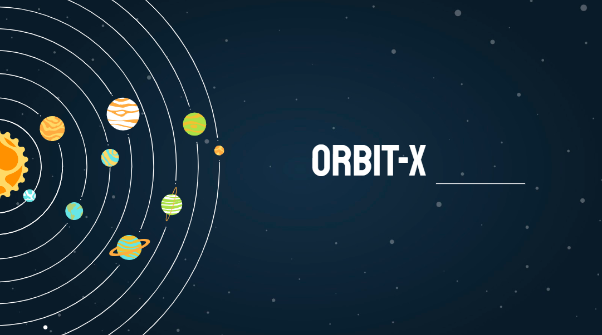

# orbit-X
A web application developed with an aim to create explorative and interactive tools to understand the orbital sky around us better. 
Flask web framework is used for the web application, and Unity3D software for the 3D application.

### Demo Video
[Link to video](https://youtu.be/akm2n-Pajfo)
 

Website is also hosted on [orbitx.epizy.com](http://orbitx.epizy.com/)

|| Project created for NASA Space Apps Challenge 2020 ||
